# Case Study: LiveData Site Health Dashboard

**Role:** Product Manager (spec + build)
**Stack:** Python, FastAPI, React 19, PostgreSQL, Claude API, AWS (App Runner, RDS, S3, CloudFront, Lambda), RapidFuzz, Terraform
**Status:** Live — widely adopted across the organization

> This is a case study. No proprietary source code or customer data is included. See `NOTICE.md`.

---

## The Problem

LiveData serves 85+ VA hospital facilities. Each site has its own operational status, open issues, staffing situation, training compliance, and account health. Customer success managers and account teams need a clear, current picture of every site — not just the ones that called in with a problem.

The challenge: the primary source of truth for site health was a collection of CSA reports and training documents — PDFs generated by field staff, structured narratively, not for machine consumption. Synthesizing that information across 85+ sites into an actionable view was a manual process. Issues got missed. Patterns across sites were invisible. Escalation decisions depended on who had the best memory.

---

## My Role

I specced and built the entire application — backend, frontend, AI extraction layer, and AWS infrastructure. It is in active daily use across the organization.

---

## What I Built

### Portfolio View
A dashboard showing all VA sites at a glance, sorted by health score. Teams can immediately see which sites need attention, filter by issue severity, and drill into any site without navigating multiple systems.

### AI-Powered Document Extraction
Field staff upload CSA reports and training documents in their existing formats. Claude extracts structured data from the unstructured text — open issues, severity levels, staffing gaps, compliance status, action items, overdue follow-ups — and writes it into the database. No manual data entry, no reformatting required.

The extraction is designed to be conservative: ambiguous items are flagged for human review rather than silently misclassified.

### Health Score Algorithm
Every site has a live health score that reflects its current state:

```
Score = 100
      - (10 × critical issues)
      - (5  × high issues)
      - (3  × medium issues)
      - (1  × low issues)
      - (3  × overdue items)
      - (5  × staffing gaps)
```

This gives teams a single number to act on while the underlying breakdown shows exactly what's driving it.

### Site Detail View
Each site has a full detail page: issue log with severity and age, document history, trend lines, staffing status, and all extracted data from uploaded reports. CSMs can see everything relevant to a site in one place.

### Trends View
Aggregate views across the portfolio — issue counts over time, health score distribution, sites improving vs. declining — giving leadership visibility into portfolio health without requiring per-site review.

### Google OAuth
Authentication via Google, appropriate for an internal tool where the team already uses Google Workspace.

### Issue Clustering & AI Analysis
Claude semantically clusters issues across all 85+ sites, surfacing cross-site patterns that would be invisible in a per-site view. A natural language Q&A interface lets CSMs ask questions like *"What's the most common issue type across VA sites this quarter?"* and get answers synthesized from the full portfolio.

### Sales Signals & Opportunity Tracking
CSA reports often surface upsell signals — a site running a product they don't have, a champion pushing for new capabilities, a pain point that maps directly to a product feature. The system extracts and tracks these as structured sales opportunities with pipeline stages (Identified → Qualified → Proposal → Closed), estimated value, probability scoring, and champion identification. Account teams see opportunities surfaced automatically from field reports rather than relying on CSMs to manually relay them.

### Enhancement Request Tracking
Feature requests captured from site visits are tracked as structured enhancement requests with status progression (Submitted → Planned → In Development → Released), business justification, priority voting, and JIRA ticket integration. Semantic clustering groups similar requests across sites, making it clear when a single feature would address 12 different site requests rather than just one.

### Portfolio Action Items
A portfolio-wide action item view across all 85+ sites — filterable by status, priority, due date, and owner type (LiveData vs. VA site vs. shared). Overdue items are surfaced automatically. This replaced a manual process of checking per-site notes to find what was outstanding.

### Admin Dashboard & Observability
Full internal observability for the team running the tool:
- **Claude API cost tracking** — daily spend, cost by request type, token usage analytics, success/failure rates
- **Extraction quality metrics** — confidence scores, fields extracted per report, user edit tracking, accuracy over time
- **Audit logging** — every admin action logged with user, IP, timestamp, and success/failure
- **System health metrics** — API error rates, Claude latency, extraction success rates

### Contact Management & Deduplication
Site contacts extracted from reports are tracked with role, department, last contact date, and visit count. Fuzzy matching (RapidFuzz) automatically detects potential duplicate contacts — flagging name matches above 85% confidence and auto-merging above 95% — keeping the contact database clean without manual auditing.

### Comprehensive Data Export
Every major data type is exportable to CSV: sites, issues, action items, enhancement requests, workflow observations, sales opportunities, and contacts. Timestamped filenames, site-prefixed exports, and proper character escaping throughout.

---

## Architecture

```mermaid
flowchart TD
    A["React 19 Frontend\nS3 + CloudFront\nPortfolio · Site Detail · Trends · Issues\nEnhancements · Action Items · Sales Signals · Admin"] --> B["FastAPI Backend\nAWS App Runner\n/auth /sites /reports /analytics /issues /admin"]
    B --> C["RDS PostgreSQL\n17 models — Sites · Issues · Reports\nEnhancements · Opportunities · Contacts\nSnapshots · Audit logs · API usage"]
    B --> D["Claude API\nDocument extraction · Issue classification\nSeverity scoring · Issue clustering · NL Q&A"]
    B --> E["S3\nDocument storage\nReport archive"]
    D --> C
    B --> F["RapidFuzz\nContact deduplication\nFuzzy name matching"]
    F --> C
```



---

## Key Design Decisions

**1. AI extraction from existing documents, not a new process**
Field staff were already creating CSA reports. Requiring them to fill out a structured form instead would have killed adoption. By extracting from the documents they were already writing, the tool fit into existing workflows rather than replacing them.

**2. Conservative extraction with human review flags**
AI document extraction fails quietly when it's wrong. The system flags low-confidence extractions for human review rather than silently writing bad data. Getting this wrong at scale — 85+ sites — would undermine trust in the tool faster than any missing feature would.

**3. Health score as a forcing function**
A numeric score is reductive by design. Its job is to force prioritization — to surface the site that needs attention without requiring someone to read through 85 status updates. The breakdown behind the score gives the full picture to anyone who clicks in.

**4. AWS App Runner for the backend**
App Runner handles containerized deployments without the operational overhead of ECS or EKS — appropriate for an internal tool that needs to be reliable but doesn't require deep infrastructure configuration. Combined with RDS and CloudFront, the total infrastructure cost is ~$25/month.

**5. Async SQLAlchemy throughout**
All database operations use async SQLAlchemy 2.0 with a dependency-injected session pattern. This keeps the backend non-blocking under load and enforces consistent data access patterns as the codebase grows.

**6. Extract everything, surface selectively**
The system extracts 17 entity types from every report — issues, action items, contacts, enhancement requests, sales opportunities, pain points, workflow observations, configuration changes, staffing flags. Not all of these are visible on the main dashboard. The design principle was to capture everything once and surface the right view to the right role, rather than decide upfront which data mattered.

---

## Outcomes

- Widely adopted across the organization — CSMs, account managers, and leadership use it daily
- Complete visibility across 85+ VA sites from a single dashboard
- Issues that previously required reading multiple PDFs are surfaced automatically
- Portfolio-level trends visible for the first time — leadership can see which sites are improving, which are declining, and why
- Field staff upload documents in their existing format; structured data appears without manual entry
- Sales opportunities surfaced automatically from field reports — account teams no longer rely on CSMs to relay upsell signals verbally
- Issue clustering identifies cross-site patterns that per-site views miss entirely
- Enhancement requests from 85+ sites consolidated and clustered, making feature prioritization decisions data-driven
